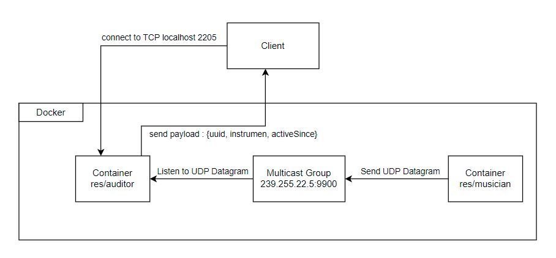

# Labo-Orchestra
author : Kylian Bourcoud

## Brief
Ce projet met en place deux types de scripts javascript qui seront contenu dans des containers docker:

Le premier se trouve dans le dossier /docker/image-musician/src/ on trouve un script musician.js.
Ce script représente un musicien jouant d'un instrument, Il envoie des datagrammes UDP sur une adresse multicast avec un numéro de port représentant le son émis par l'instrument.
Lorsque l'on execute ce script il faut lui préciser un instrument parmi 5:
- piano
- trumpet
- flute
- violin
- drum

Le second script se trouve dans le dossier /docker/image-musician/src/.
Il reprèsente un auditeur écoutant les musiciens. Il enregistre les musiciens actifs en
écoutant les instruments à la même adresse multicast et le même numéro de port que les musiciens.
Si on se connecte à lui via TCP il renvoie un tableau d'objet contenant tout les musiciens actifs.

## Information réseau
Les containers dockers communiquent entre eux via l'adress multicast '239.255.22.5 et le numéro de port 9900
Le container auditor utilise pour le serveur TCP le numero de port 2205

## Construire les images docker
Pour pouvoir run le projet,
1. Télécharger docker pour votre OS
2. Forker et le cloner en local.
3. Accéder via un terminal au dossier /docker/image-auditor/
4. Exécuter la commande ci-dessous afin de construire une image docker pour le script auditor.js:
```
docker build -t res/auditor .
```
5. Accéder via un terminal au dossier /docker/image-musician/
6. Exécuter la commande ci-dessous afin de construire une image docker pour le script musician.js:
```
docker build -t res/musician .
```
## Run les containers
Maintenant que les images sont construites, on peut lancer les containers
1. Exécuter la commande suivante via un terminal pour lancer un container auditor
```
docker run -d -p 2205:2205 res/auditor
```

2. Exécuter la commande suivante via un terminal pour lancer un container musician
```
docker run -d -res/musician <instrument>
```
où instrument est un des cinq instruments précisé dans le brief

3. Pour accéder au container auditor, vous pouvez utiliser telnet et accéder à localhost sur le port 2205

## Questions
## Task 1: design the application architecture and protocols

| #  | Topic |
| --- | --- |
|Question | How can we represent the system in an **architecture diagram**, which gives information both about the Docker containers, the communication protocols and the commands? |
| |  |
|Question | Who is going to **send UDP datagrams** and **when**? |
| | The musicians will send UDP datagram on a multicast adress |
|Question | Who is going to **listen for UDP datagrams** and what should happen when a datagram is received? |
| | The auditor will listen to the UDP datagramms and register the data of active musician |
|Question | What **payload** should we put in the UDP datagrams? |
| | an object with the uuid, the instrument and the song emitted |
|Question | What **data structures** do we need in the UDP sender and receiver? When will we update these data structures? When will we query these data structures? |
| | sender : An object musician which register the instrument. This data will never be update, and send to the multicast address each second.
| | receiver: A map that register all the active musician. This structure is modidy with each datagram received or when a musician stop playing for more than 5 seconds|


## Task 2: implement a "musician" Node.js application

| #  | Topic |
| ---  | --- |
|Question | In a JavaScript program, if we have an object, how can we **serialize it in JSON**? |
| | with JSON.stringify(object)  |
|Question | What is **npm**?  |
| | un package manager pour javascript  |
|Question | What is the `npm install` command and what is the purpose of the `--save` flag?  |
| | install a library for the project |
|Question | How can we use the `https://www.npmjs.com/` web site?  |
| |We can find a library for the UUID  |
|Question | In JavaScript, how can we **generate a UUID** compliant with RFC4122? |
| | We can use the uuid library  |
|Question | In Node.js, how can we execute a function on a **periodic** basis? |
| | with the setInterval function  |
|Question | In Node.js, how can we **emit UDP datagrams**? |
| | with the method send of the dgram socket |
|Question | In Node.js, how can we **access the command line arguments**? |
| | with process.argv[...]  |


## Task 3: package the "musician" app in a Docker image

| #  | Topic |
| ---  | --- |
|Question | How do we **define and build our own Docker image**?|
| | with a dockerfile file and the command docker build |
|Question | How can we use the `ENTRYPOINT` statement in our Dockerfile?  |
| | ENTRYPOINT execute the command when the container is build from the image  |
|Question | After building our Docker image, how do we use it to **run containers**?  |
| | with the command docker run  |
|Question | How do we get the list of all **running containers**?  |
| | with the command docker ps -all  |
|Question | How do we **stop/kill** one running container?  |
| | with the command docker kill  |
|Question | How can we check that our running containers are effectively sending UDP datagrams?  |
| | with tcpdump to monitor the UDP traffic  |


## Task 4: implement an "auditor" Node.js application

| #  | Topic |
| ---  | ---  |
|Question | With Node.js, how can we listen for UDP datagrams in a multicast group? |
| | bind to the UDPPort and addMembership  |
|Question | How can we use the `Map` built-in object introduced in ECMAScript 6 to implement a **dictionary**?  |
| | To register the active musician |
|Question | How can we use the `Moment.js` npm module to help us with **date manipulations** and formatting?  |
| | This library is deprecated |
|Question | When and how do we **get rid of inactive players**?  |
| | After 5 second with a setInterval function |
|Question | How do I implement a **simple TCP server** in Node.js?  |
| | with the library net |


## Task 5: package the "auditor" app in a Docker image

| #  | Topic |
| ---  | --- |
|Question | How do we validate that the whole system works, once we have built our Docker image? |
| | Execute the validate.sh at the root directory  |